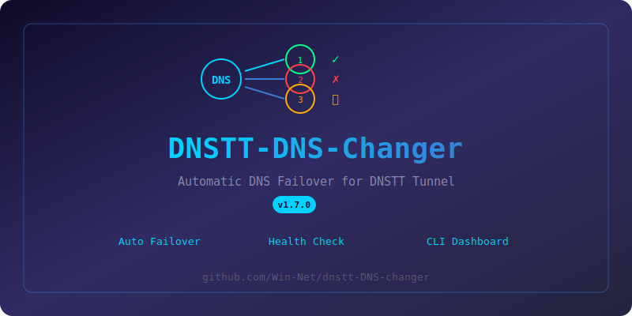

<div align="center">
    


<br><br>

[](https://github.com/Win-Net/dnstt-DNS-changer)
[](LICENSE)
[]()

**[English](#english)** | **[فارسی](#فارسی)**

</div>

---

<a name="english"></a>
## 🇬🇧 English

### What is this?
DNSTT-DNS-Changer manages multiple DNS servers for your DNSTT tunnel. When one DNS server goes down, it automatically switches to the next one.

### Features
- 🔄 **Auto Failover** — Switches DNS automatically when current one fails
- 🩺 **Health Monitoring** — Checks connection every 10 seconds
- 📊 **CLI Dashboard** — Beautiful terminal management interface
- ⚙️ **Easy Config** — Simple configuration file
- 🔁 **Round-Robin** — Cycles through all DNS servers
- 📝 **Full Logging** — Complete event logs

### Quick Install

```bash
bash <(curl -sL https://raw.githubusercontent.com/Win-Net/dnstt-DNS-changer/main/install.sh)
```

### After Install

```bash
winnet-dnstt
```

### CLI Menu

| # | Option |
|---|--------|
| 1 | Service Status & Details |
| 2 | Start Service |
| 3 | Stop Service |
| 4 | Restart Service |
| 5 | View Live Logs |
| 6 | Server Switch History |
| 7 | Edit Configuration |
| 8 | Test Connection |
| 9 | Show Current Config |
| 10 | Update Script |
| 11 | Uninstall |
| 0 | Exit |

### Configuration

```bash
nano /etc/dnstt-DNS-changer/config.conf
```

Example:
```ini
DNS_SERVERS=(
    "188.213.65.54:53"
    "185.100.200.10:53"
    "91.230.110.25:53"
)

DOMAINS=(
    "n.example.com"
    "n.example.com"
    "n.example.com"
)
```

### File Locations

| File | Path |
|------|------|
| Config | `/etc/dnstt-DNS-changer/config.conf` |
| CLI | `/usr/local/bin/winnet-dnstt` |
| Service | `/etc/systemd/system/dnstt-DNS-changer.service` |
| Public Key | `/etc/dnstt-DNS-changer/pub.key` |

### Requirements
- Linux (Ubuntu / Debian / CentOS)
- Root access
- `dnstt-client` binary
- Public key file (`pub.key`)

### Uninstall
```bash
winnet-dnstt
# Select option 10
```
## 🎁 Financial support
If **WinNet** is useful and practical for you and you would like to support its development, you can support it financially on one of the following crypto networks:

- TON network : `UQAwote266R2INGvHR2DS-B7jeSjIlxZIlx851LNvvHxmwY8`
- USDT, TRON network(TRC20) : `THA4Lt2hUNX3L8fJkssmUPekUqwXWuYmcR`
- ETH network(ERC20) : `0xaa47f46D809152291B011E333a93430DB4649578`
<div align="center">
Thank you in advance for your support ❤️🙏
</div>
---

<a name="فارسی"></a>
## 🇮🇷 فارسی

### این ابزار چیه؟
DNSTT-DNS-Changer چندین سرور DNS رو برای تانل DNSTT مدیریت میکنه. اگه یه DNS از کار بیفته، خودکار به بعدی سوئیچ میکنه.

### امکانات
- 🔄 **سوئیچ خودکار** — وقتی DNS فعلی قطع بشه خودکار عوض میکنه
- 🩺 **مانیتورینگ** — هر ۱۰ ثانیه وضعیت رو چک میکنه
- 📊 **پنل مدیریت** — منوی زیبا در ترمینال
- ⚙️ **تنظیم آسان** — فایل کانفیگ ساده
- 🔁 **چرخشی** — بین همه سرورها میچرخه
- 📝 **لاگ کامل** — ثبت همه رویدادها

### نصب سریع

```bash
bash <(curl -sL https://raw.githubusercontent.com/Win-Net/dnstt-DNS-changer/main/install.sh)
```

### بعد از نصب

```bash
winnet-dnstt
```

### منوی مدیریت

| # | گزینه |
|---|-------|
| 1 | وضعیت سرویس |
| 2 | شروع سرویس |
| 3 | توقف سرویس |
| 4 | ریستارت سرویس |
| 5 | لاگ زنده |
| 6 | تاریخچه تغییر سرور |
| 7 | ویرایش تنظیمات |
| 8 | تست اتصال |
| 9 | نمایش تنظیمات |
| 10 | آپدیت اسکریپت |
| 11 | حذف |
| 0 | خروج |

### تنظیمات

```bash
nano /etc/dnstt-DNS-changer/config.conf
```

### نیازمندی‌ها
- لینوکس (اوبونتو / دبیان / سنتاس)
- دسترسی روت
- فایل `dnstt-client`
- فایل کلید عمومی (`pub.key`)

---


<br>

## 🎁 حمایت مالی
اگر **وین نت** برای شما مفید و کاربردی بوده و مایل هستید از توسعه آن حمایت کنید ، می‌توانید در یکی از شبکه های کریپتو زیر حمایت مالی کنید :
- TON network : `UQAwote266R2INGvHR2DS-B7jeSjIlxZIlx851LNvvHxmwY8`
- USDT, TRON network(TRC20) : `THA4Lt2hUNX3L8fJkssmUPekUqwXWuYmcR`
- ETH network(ERC20) : `0xaa47f46D809152291B011E333a93430DB4649578`

<div align="center">

پیشاپیش از حمایت شما متشکریم ❤️🙏
